# 🎬 Tamasha

> **Nairobi's Ultimate Entertainment Hub.**
> A full-stack platform that aggregates real-time cinema schedules and manages custom events, providing moviegoers and event planners with a seamless, cinematic experience.
---
### 📸 Application Screenshots

#### 🏠 Home Page
| Desktop | Mobile |
|:---:|:---:|
| 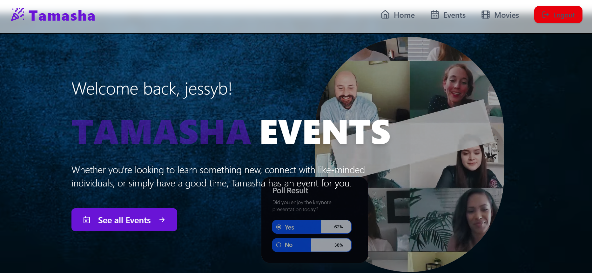 |  |

#### 🔐 Authentication
| Desktop Signup | Mobile Signup |
|:---:|:---:|
| 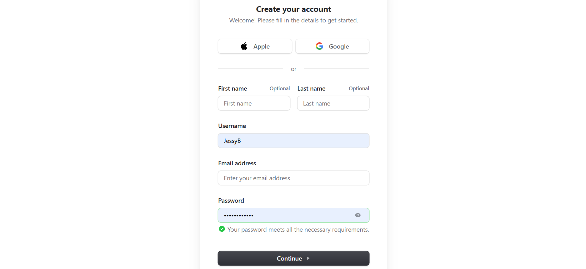 |  |

#### 🔍 Events Page
| Desktop Page | Mobile Page |
|:---:|:---:|
| 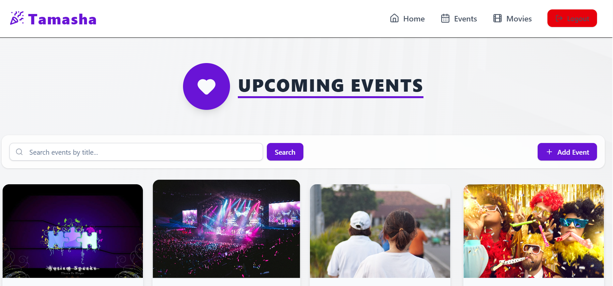 <br> 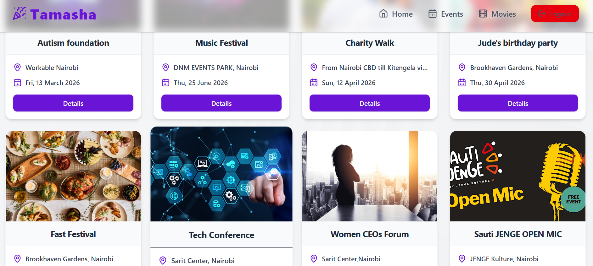 |  |

#### 🔍 Event Details Page
| Desktop Page | Mobile Page |
|:---:|:---:|
| 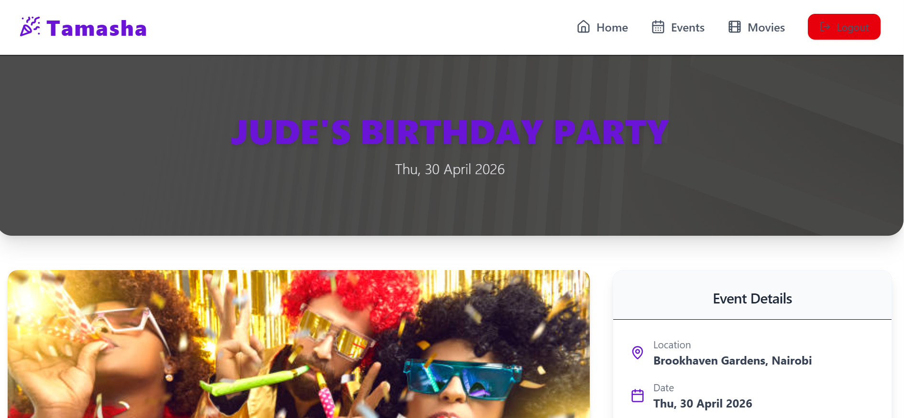 <br> <br> 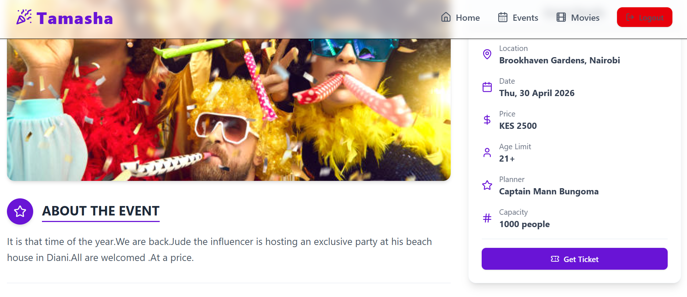 |  <br> <br>  |

#### 🎬  Movies Page
| Desktop Page | Mobile Page |
|:---:|:---:|
| 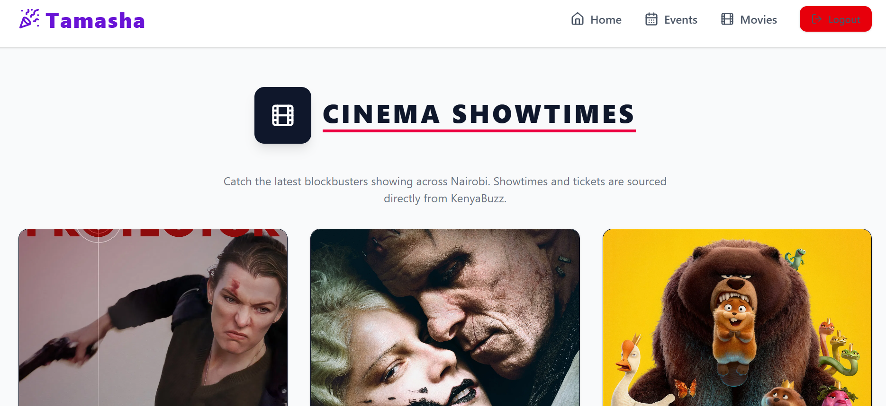 <br> <br> 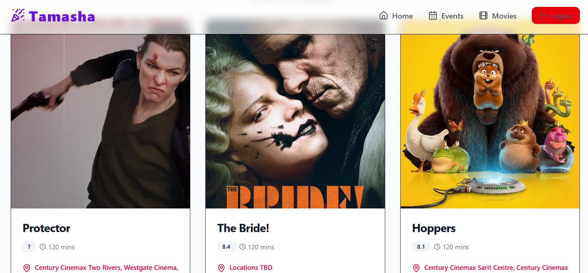  <br> <br> 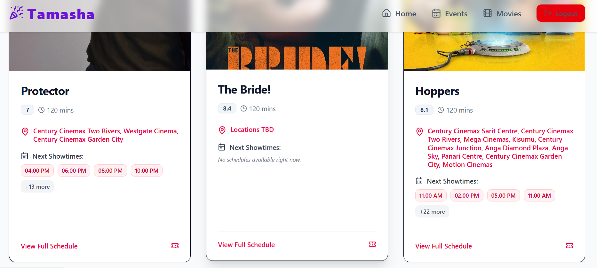|  <br> <br>  |

#### 🎬  Movie Details Page
| Desktop Page | Mobile Page |
|:---:|:---:|
| 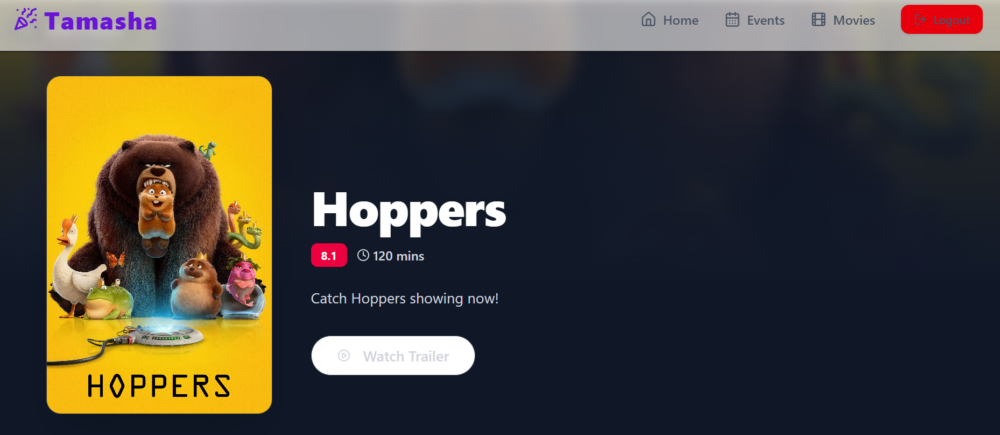 <br> <br> 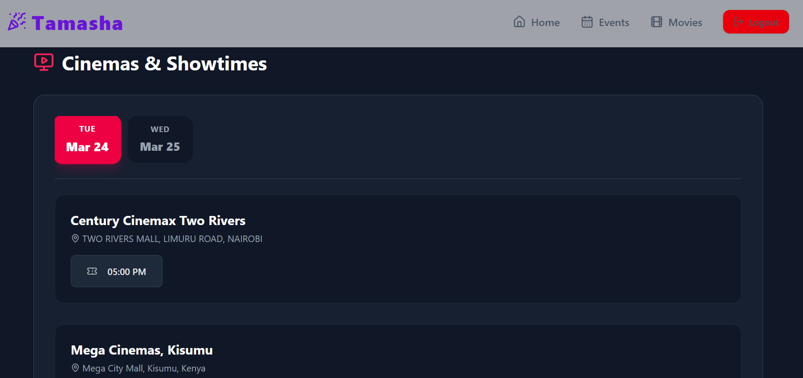|  <br> <br>  |

---


## 📋 Table of Contents
- [About](#-about)
- [Key Features](#-key-features)
- [Tech Stack](#-tech-stack)
- [Architecture](#-architecture)
- [Getting Started](#-getting-started)
- [Running Tests](#-running-tests)
- [API Documentation](#-api-documentation)
- [Author](#-author)

---

## 📖 About
**Tamasha** bridges the gap in Nairobi's entertainment scene by unifying fragmented cinema schedules and event management. Instead of navigating multiple theater websites, Tamasha aggregates real-time showtimes, cinema locations, and ticket availability into one platform, alongside a robust system for managing conferences, meetups, and community events.

---

## 🚀 Key Features
* **🍿 Real-Time Cinema Aggregator:** Automatically scrapes and maps current movies to specific cinemas, dates, and showtimes across Nairobi.
* **📅 Custom Event Management:** A full CRUD system for managing conferences, including speaker tracking and sponsor details.
* **🔐 Secure Authentication:** Seamless user onboarding powered by Clerk for secure session management.
* **🎨 Cinematic UI:** A premium, dark-mode focused design with dynamic blurred backgrounds and responsive movie/event grids.
* **🛡️ Stealth Scraping:** Engineered with anti-bot bypass techniques to ensure reliable data synchronization.
* **🧠 Smart Data Grouping:** Automatically organizes massive schedule datasets by date and cinema location for an intuitive booking experience.

---

## 🛠 Tech Stack

### **Frontend**
* **React.js** (Vite) - Component-based UI architecture.
* **TypeScript** - Type-safe development.
* **Tailwind CSS** - Modern, utility-first styling.
* **shadcn/ui & Lucide React** - Premium UI components and icon set.
* **Clerk** - Secure user authentication.
* **Toastify** - User feedback notifications.

### **Backend**
* **Django REST Framework (DRF)** - Robust API development.
* **Django ORM** - Database abstraction and management.
* **Cloudscraper & Requests** - Robust web-scraping engine with TLS fingerprint evasion.
* **Gunicorn** - Production-grade WSGI server.
* **SQLite** (Dev) / **PostgreSQL** (Prod) - Data persistence.

---

## 🏗 Architecture
The application follows a decoupled **Client-Server Architecture**:

1.  **Client (Frontend):** Consumes RESTful APIs, manages complex UI states (grouping schedules by date/cinema), and handles auth via Clerk.
2.  **Server (Backend):** Houses the relational database (Events, Cinemas, Showtimes), manages business logic, and executes automated scraping pipelines.
3.  **Data Pipeline:** A scheduled Python management command handles stealth requests to external APIs, ensuring local data mirrors real-time availability.
---

## 🏁 Getting Started

Follow these instructions to set up the project locally on your machine.

### Prerequisites
* Python 3.8+
* Node.js & npm
* Git

### 1. Backend Setup
```bash
# Clone the repository
git clone [https://github.com/JessyWaweru/TAMASHA-BACKEND.git](https://github.com/JessyWaweru/TAMASHA-BACKEND.git)
cd TAMASHA-BACKEND

# Create a virtual environment
python -m venv venv

# Activate virtual environment
# On Windows:
venv\Scripts\activate
# On Mac/Linux:
source venv/bin/activate

# Install dependencies
pip install -r requirements.txt

# Run database migrations
python manage.py migrate

# Populate Cinema Data
python manage.py scrape_movies

# Start the Django server
python manage.py runserver
```

### 2. Frontend Setup
This project uses a separate repository for the frontend.

1.  Clone the frontend repository:
    ```bash
    git clone [https://github.com/JessyWaweru/TAMASHA-FRONTEND.git](https://github.com/JessyWaweru/TAMASHA-FRONTEND.git)
    cd TAMASHA-FRONTEND
    ```

2.  Install dependencies and start:
    ```bash
    npm install
    npm run dev
    ```
## 🧪 Running Tests
This project maintains high code quality through automated integration tests.
To run the test suite:
```bash
cd backend
python manage.py test -v 2
```

## 📡 API Documentation

| Method | Endpoint | Description | Access |
| :--- | :--- | :--- | :--- |
| **GET** | `/api/events/` | List all Events | 🌍 Public |
| **POST** | `/api/login/` | Login & receive Token | 🌍 Public |
| **GET** | `/api/events/{id}/` | Get details (with nested schedules) | 🌍 Public |
| **POST** | `/api/events/` | Create a custom event | 🔐 Authenticated |
| **GET** | `/api/cinemas/` | List Participating Cinemas | 🌍 Public |

## 👨‍💻 Author

**JESSY BRYAN WAWERU**
*Full Stack Developer*
